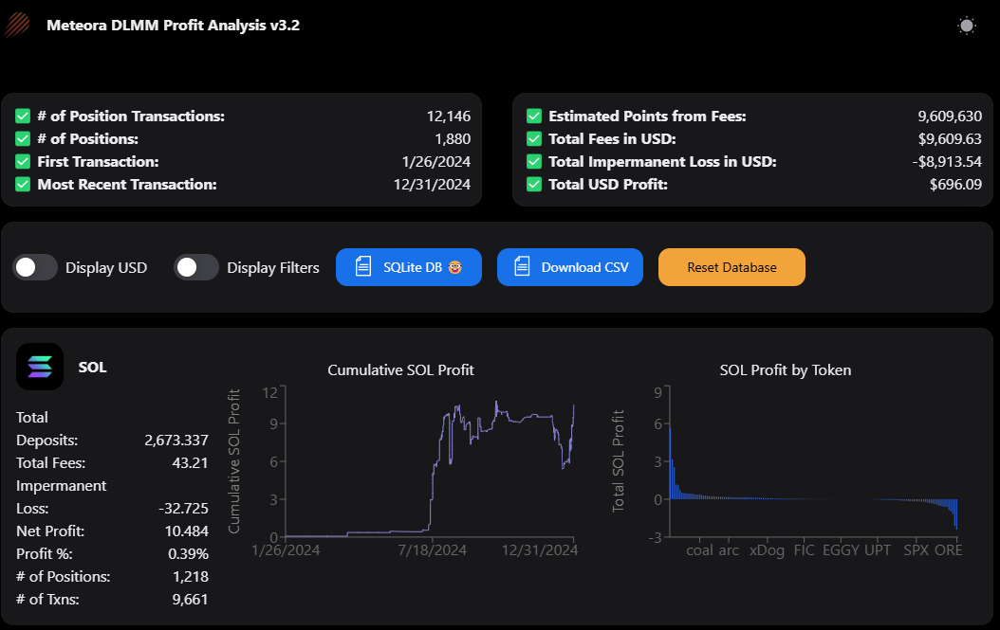
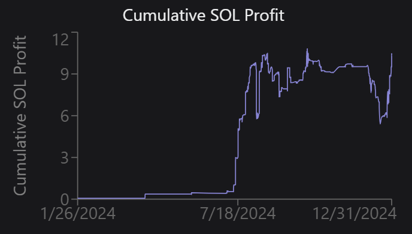
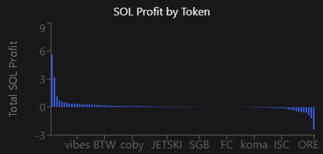
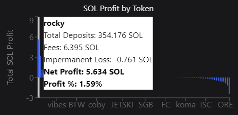
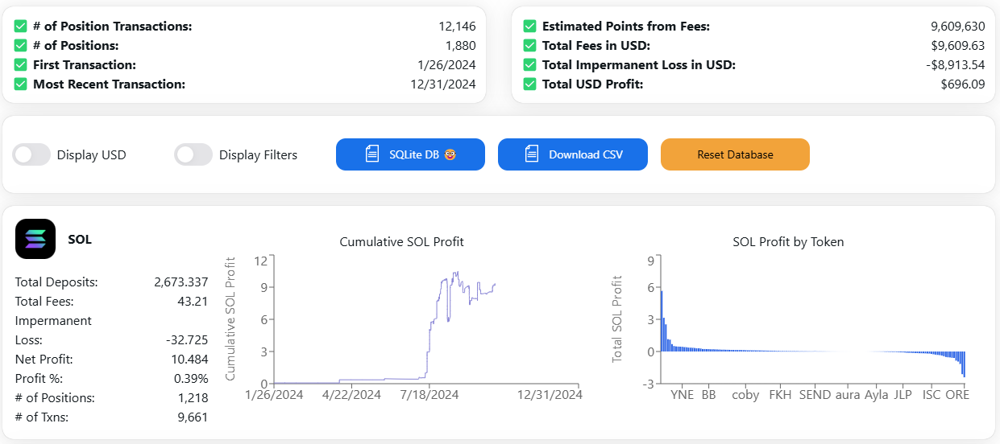

# Meteora DLMM Profit Analysis v3.2

[](https://geeklad.github.io/meteora-profit-analysis/)

A web application that allows you to see estimated profitability on Meteora
DLMM pools for a specific wallet or transaction.

## Try it Live on GitHub Pages

https://geeklad.github.io/meteora-profit-analysis/

## Features

### Estimated MET Points


When you provide liquidity on the Meteora protocol, you can earn points toward
the MET token. Read the [10% LP Stimulus Plan proposal](https://proposals.meteora.ag/t/10-lp-stimulus-plan/9) for more info.

### Faster Loading after Initial Load

Transaction data is saved in your web browser's storage to speed up future
visits made to the tool. If you clear your browser data, it will
need to perform the initial load over again. The initial load can take quite
some time if you have a wallet with many transactions.

### Profitability Over Time



See how much profit you have earned over time.

### Profitability by Base Token




The bar chart shows you the tokens you've LPed, sorted by profit, so you can
quickly and easily identify your big winners and big losers. When you
mouseover them, you get a tooltip that provides some detai with your market
making performance for the token.

### Display Profits in USD


By default, the charts and quote token summaries are displayed in terms of the
quote token. However, you can toggle the display to show the profits in USD
instead.

### Filtering


Click the **Display Filters** toggle, and the filter options will be displayed.
There are a number of different ways to filter the analysis:

- Transaction date
- Transaction status: look at only open or closed positions, or all statuses
- Hawksight positions: include or exclude them, or look at only Hawksight
  positions
- Quote tokens: this is the token used to denominate the price of the other
  token (in most cases, SOL or USDC)
- Base tokens: this is the token which is being bought/sold using the quote
  token

### Download Transactions


You can download all your transactions in a CSV file. If you're a nerd that
knows SQL, you can download the [SQLite database](https://www.sqlite.org/) used
to store transaction data. If you need a SQL client to dig into the database,
I highly recommend [DBeaver](https://dbeaver.io/).

### Light Mode / Dark Mode Toggle



By default the app uses dark mode, but you can switch to light mode if you
really want to.

## Technologies Used

- [Meteora DLMM Datbase]()
- [Next.js 14](https://nextjs.org/docs/getting-started)
- [NextUI](https://nextui.org)
- [Tailwind CSS](https://tailwindcss.com)
- [Tailwind Variants](https://tailwind-variants.org)
- [TypeScript](https://www.typescriptlang.org)
- [Framer Motion](https://www.framer.com/motion)
- [next-themes](https://github.com/pacocoursey/next-themes)

## How to Use

### Install Bun

Install bun using the instructions at https://bun.sh/docs/installation.

### Install dependencies

Install using bun:

```bash
bun install
```

### Run the development server

```bash
bun run dev
```

### Build static html output that can be hosted

The app can be built to be hosted on 100% static HTML pages, which will be
output to `/out`. To build the project:

```bash
bun run build
```
